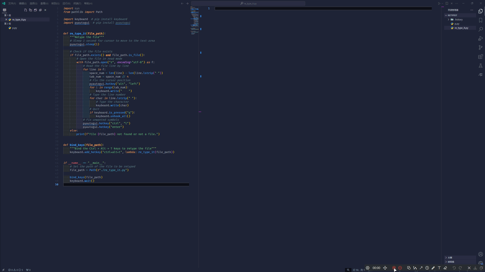

# Re Type It

Read from a file and type it out letter by letter, like generated by AI.

## Usage

1. Modify the `file_path` and `hotkey` in `re_type_it.py`
2. Run `re_type_it.py`
3. Press the hotkey to start typing

## Requirements

- Python 3.x
- PyAutoGUI
- Keyboard
